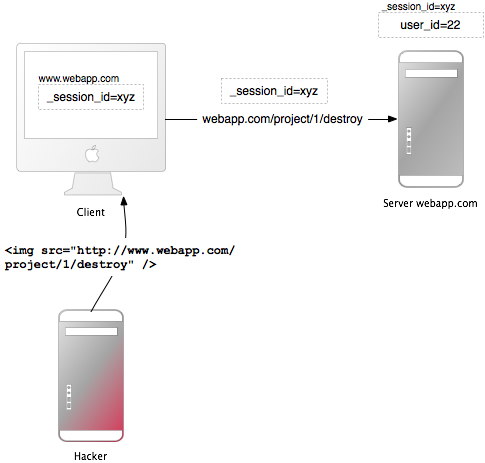

## A01 Broken Access Control

### Vefforritun

### Ólafur Sverrir Kjartansson, [osk@hi.is](mailto:osk@hi.is)

---

## [A01 Broken Access Control](https://owasp.org/Top10/A01_2021-Broken_Access_Control/)

* Mjög mörg vefforrit sem útfæra aðgangsstýringu og auðkenningu hafa einhversskonar öryggisveikleika
* Getur haft í för með sér gagnaleka, breytingum á gögnum af aðilum sem ekki eiga að geta það eða jafnvel eyðingu allra gagna

***

* Margt sem þarf að hafa í huga og ættum alltaf að fara yfir lista og tengd atriði þegar við útfærum
* Mikið af skjölun og leiðum til að passa upp á öryggi [út frá OWASP lista](https://owasp.org/Top10/A01_2021-Broken_Access_Control/#list-of-mapped-cwes)

---

## Aðgengi

* Að fela aðgang að ákveðnum hlutum er ekki öruggt
  * Aðeins innskráðir notendur sjá link á `/admin`
  * ...en allir sem prófa fá aðgang
* Athugum alltaf hvort aðgangur sé heimill fyrir allar aðgerðir sem krefjast þess

***

* Notanda gefin tækifæri til að eiga beint við vísun í gögn
  * Má skoða `http://example.org/secureData?id=1`
  * En hvað með `http://example.org/secureData?id=2`?
* Athugum alltaf hvort heimild sé fyrir að sækja gögn

---

## CSRF

* Númer 8 árið 2013
* Árásaraðili setur link hjá sér yfir á vef með ákveðinni aðgerð, ef notandi er auðkenndur er aðgerð keyrð
  * ``

***

* Til að forðast setjum við falið gildi í form sem er staðfest á bakenda
* Biðjum notanda að auðkenna sig áður en ákveðnar aðgerðir eru keyrðar

***

***

## CSRF og Express

* [csurf](https://github.com/expressjs/csurf) er middleware sem takmarkar CSRF árásir
* Bætum við og setjum csrf token í hvert form
  * Tímaháður token er búinn til _áður en_ notandi fer á síðu með aðgerð
  * `<input type="hidden" name="_csrf" value="{{csrfToken}}">`
  * Þegar notandi keyrir aðgerð verður réttur token að vera til staðar, annars villa
